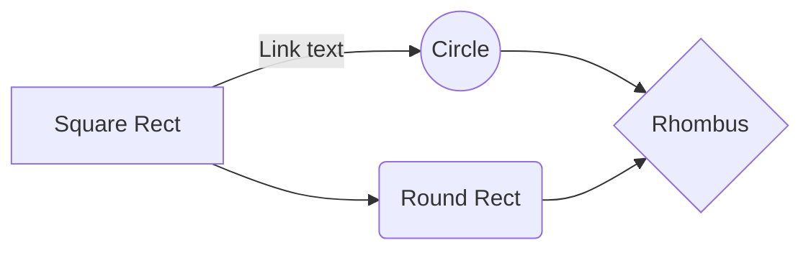

https://arxiv.org/

Anomaly detection : https://github.com/yzhao062/anomaly-detection-resources

```mermaid
graph LR
A[Square Rect] -- Link text --> B((Circle))
A --> C(Round Rect)
B --> D{Rhombus}
C --> D
```
